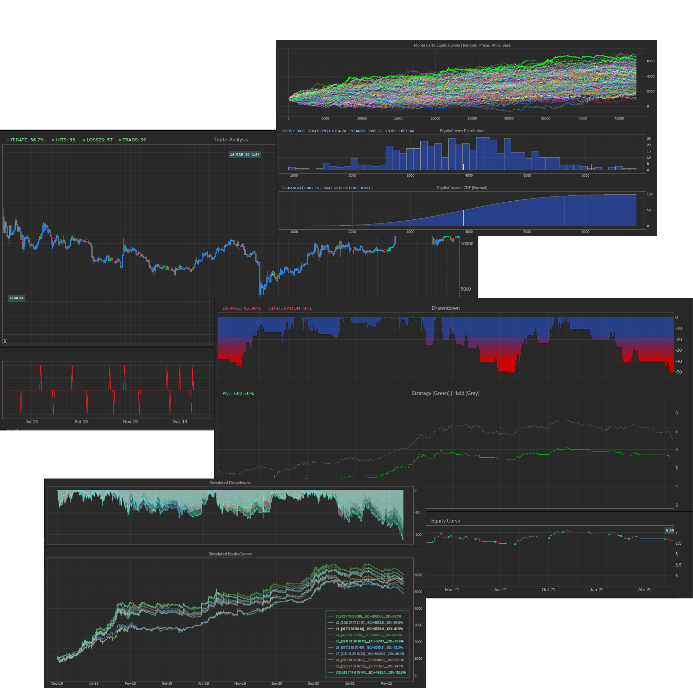
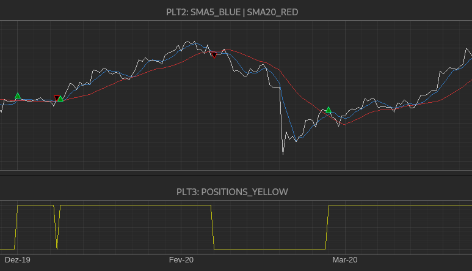
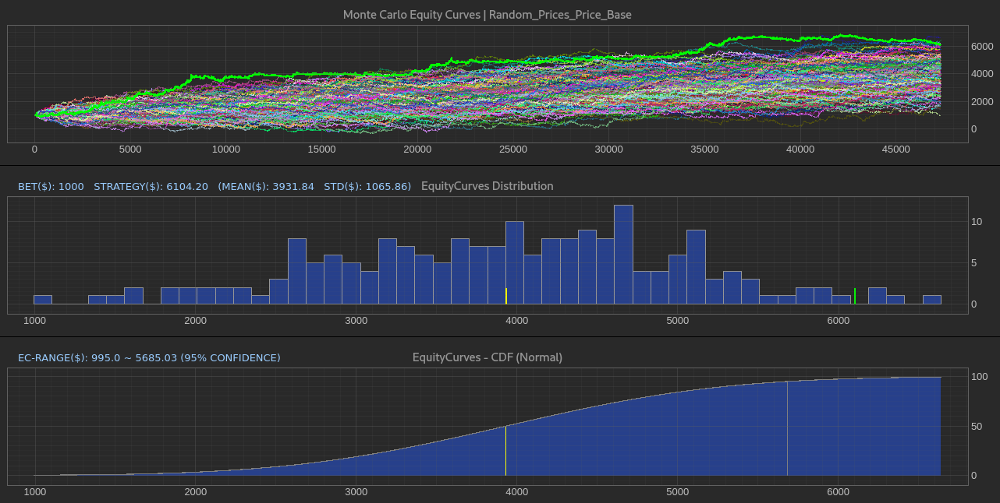
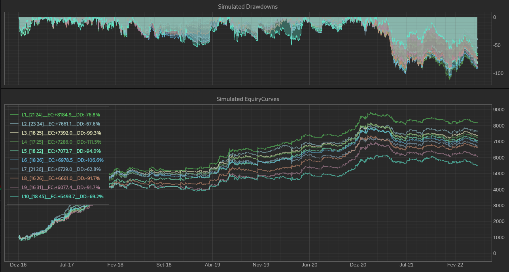
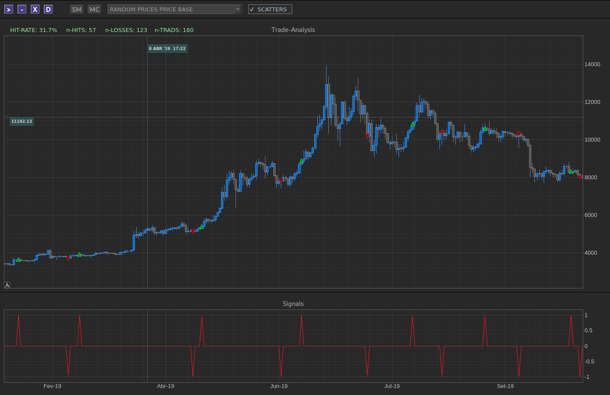
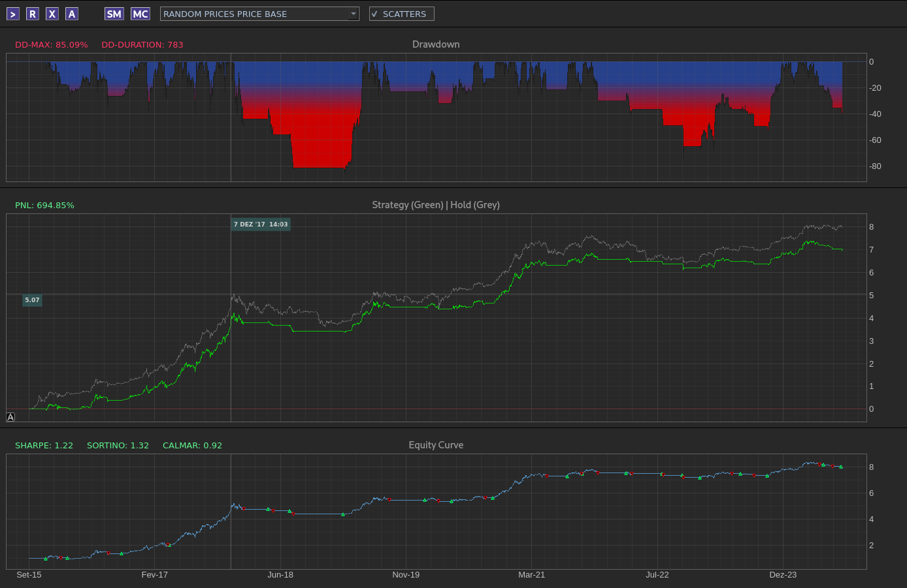
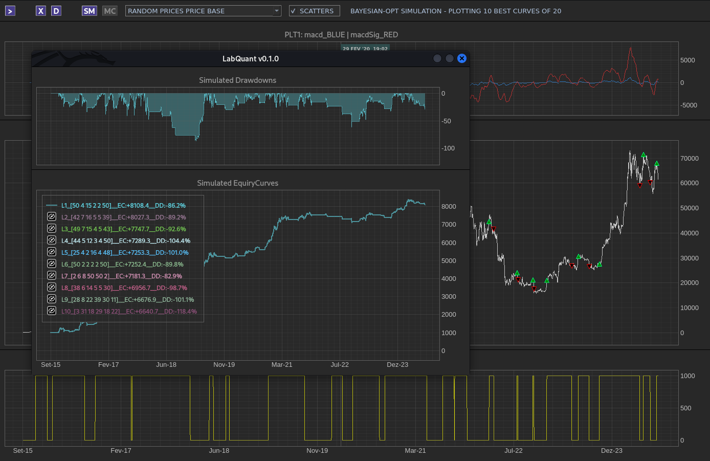
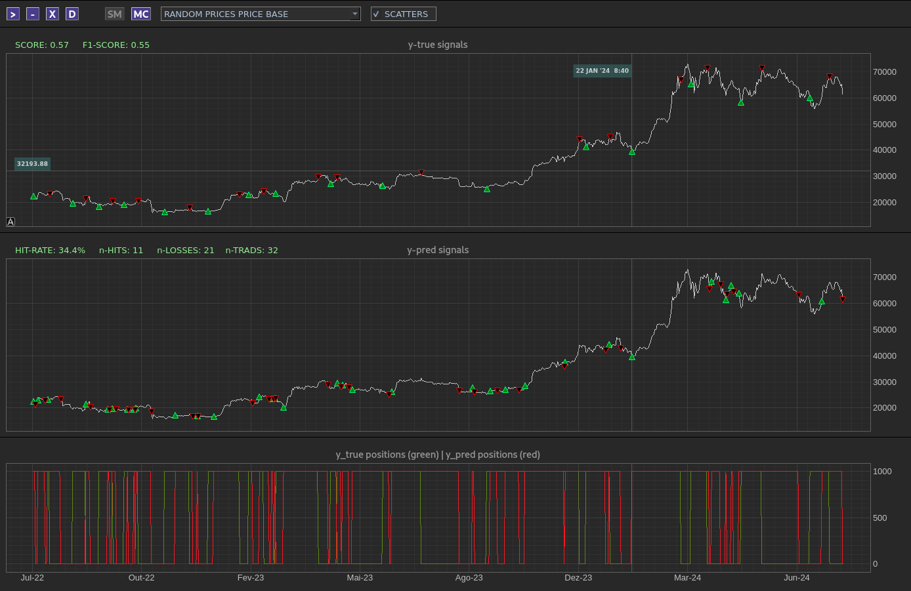
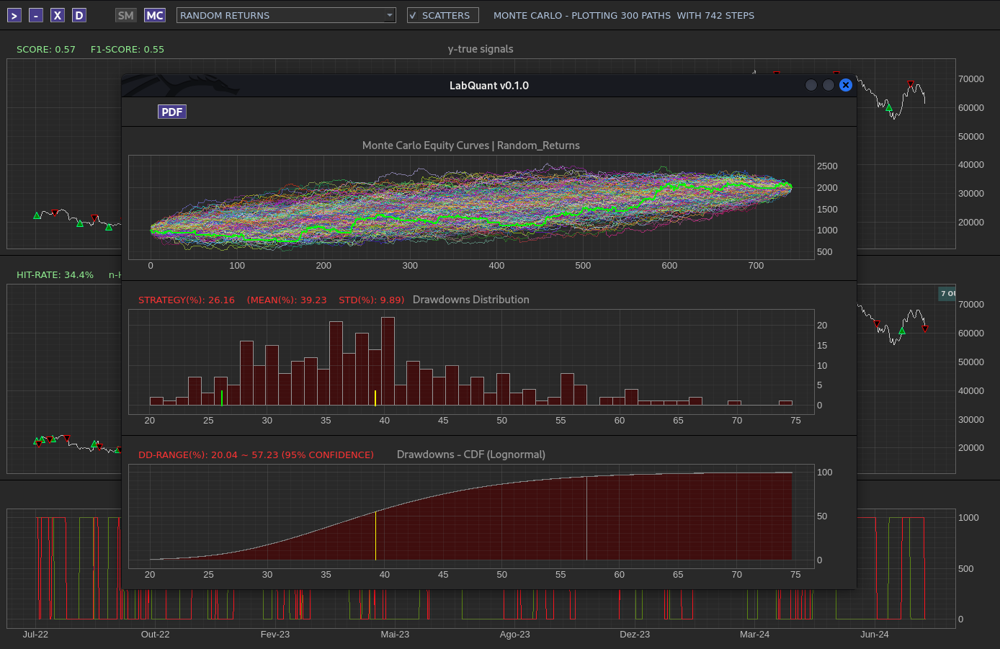
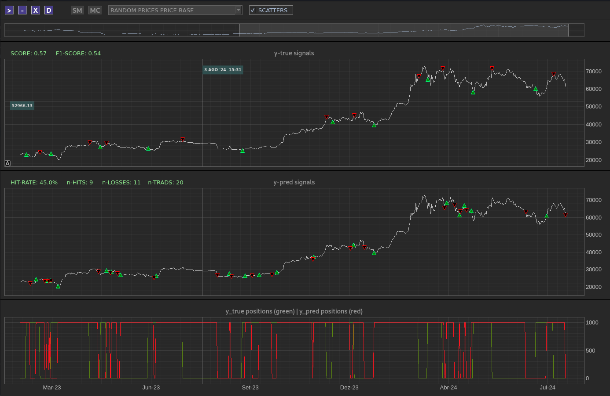

<br/>

# LabQuant

<br/>

**LabQuant** is a tool to support the development and evaluation of algo-strategies in quantitative finance. This initiative is a continuation of the labtrade project, bringing a complete upgrade of the previous one.

This project aims to be an auxiliary tool for scientific research in the quantitative environment, making it easy and fast to prototype ideas that may or may not be profitable. Profitable strategies are quite complex, due to the non-linear behavior of prices. Several optimized solutions and libraries were used in the development, bringing several features such as: OHLC manipulation at scale, Monte Carlo testing, hyperparameter simulations with search in grid, randomized and Bayesian optimizations, plus other features.

<h3 align="center">
  
</h3>

<br/>

### Warning

This tool should be used for research purposes and for prototyping ideas, therefore not using it as a unique starting point for decision making in the real market. Unsuccessful operations can lead to incalculable financial losses.

<br/>

## Features

- Support for develop strategies in tecnhical analisys, machine learning and deep learning techniques
- Future and Spot markets strategies
- Strategy backtest
- Backtest with data window filter - ROI (Region of Interest)
- Analyse of performance (Equity-curves | Drawndowns | Trad returns | Hit-rate | Cumulative gains)
- Analyse of risk (Sharpe-Ratio | Sortino | Calmar)
- Market emulation (stop-loss | stop-gain | oders-fee's)
- OHLC data manipulation at scale - tested with 5 million of ticks
- Monte Carlo analysis
- Hyperparameter search (Grid | Random | Bayesian Optmization)
- User-friendly visual for quantitative analysis powered by awesome PyQtGraph project
- Prototype and evaluate your algo-strategies with just a few lines of code

<br/>

## Prerequisites

- [Poetry](https://python-poetry.org/)
- [Python &gt;= 3.11](https://www.python.org/downloads/)
- Ambiente Linux | Windows

<br/>

## Get started

#### Virtualenv (Recommended):

- Create a virtual environment

```
python -m venv .venv
```

- Activate the virtual environment

```
# Linux
source .venv/bin/activate

# Windows
.venv\Scripts\activate
```

- Install the package

```
pip install labquant
```

#### Direct via pip:

```
pip install labquant
```

<br/>

## Usage

#### Chart Buttons

|             Buttons             |             Function             |
| :-----------------------------: | :-------------------------------: |
|  |   Performance - metrics of risk   |
|  | Positions - Signals - Signal-size |
|  |      Features visualization      |
|  |     Close price distribution     |
|  |         Returns analysis         |
|  |         Cumulative amount         |
|  |  Start hyperparameter simulation  |
|  |      Start Monte Carlo test      |

<br/>

#### Monte Carlo Chart Buttons

|             Buttons             |            Function            |
| :------------------------------: | :-----------------------------: |
|  |      MC Drawdown analysis      |
|  |    MC Equity curve analysis    |
|  | MC Probability density function |
|  | MC Cumulative density function |

<br/>

#### Chart Symbols

| Symbols |  |  |  |  |  |  |
| :-----: | :------------------------------: | :------------------------------: | :------------------------------: | :------------------------------: | :------------------------------: | :------------------------------: |
| Signal |               Long               |              Short              |            Exit Short            |            Exit Long            |            Stop loss            |           Take Profit           |

<br/>

#### Simple strategy

- The columns of the OHLCV dataframe must be in the pattern ['time', 'o', 'h', 'l', 'c', 'vol']
- Formats for attribute "time": datetime64[ns], date string format or epoch unix timestamp
- Drop time for index order
- The "str_params" parameter must follow a list pattern in this order: [df_ohlcv, amount, ...other parameters here,...]

```python
import numpy as np
import pandas as pd
from labquant import LabQuant

# Load Data (OHLCV)
df_ohlcv = pd.read_csv(".../*.csv")

# Strategy
def strategy(args):

    df = args[0].copy()
    amount = args[1]

    # Strategy logic
    df["SMA5"] = df["c"].rolling(5).mean()
    df["SMA20"] = df["c"].rolling(20).mean()
    df["positions"] = np.where(df.SMA5 > df.SMA20, amount, 0)

    return df

# Amount reference
amount = 1000
# Data preparation for LabQuant
str_params = [df_ohlcv, amount]
data = strategy(str_params)
# Lab start
lab = LabQuant(data)
lab.start(show_candles=True,)
```

<br/>

#### Features visualization

- LabQuant provides an option to view features and other signals generated in the strategy.

```python
...
# Strategy
def strategy(args):
    ...
    ...

    # Set features visualization (optional)
    # <name>_PLT<plot number 1|2|3>_<color BLUE|RED|YELLOW|GREEN|WHITE|MAGENTA|CYAN|ORANGE>
    df["SMA5_PLT2_BLUE"] = df.SMA5.values  
    df["SMA20_PLT2_RED"] = df.SMA20.values
    df["POSITIONS_PLT3_YELLOW"] = df.positions.values 

    return df
...
```

- Rendered features

<h3 align="center">
  
</h3>

<br/>

#### Monte carlo test
- This feature evaluates the performance of the strategy by applying it in an environment with random parameters
- To enable the Monte Carlo test, it is necessary to set the "strategy" and "str_params" parameters
- For more settings, see "start method" parameters table

```python
import numpy as np
import pandas as pd
from labquant import LabQuant

# Load Data (OHLCV)
df_ohlcv = pd.read_csv(".../*.csv")

# Strategy
def strategy(args):
  
    df = args[0].copy()
    amount = args[1]

    # Strategy logic
    df["SMA5"] = df["c"].rolling(5).mean()
    df["SMA20"] = df["c"].rolling(20).mean()
    df["positions"] = np.where(df.SMA5 > df.SMA20, amount, 0)

    return df

# Amount reference
amount = 1000
# Data preparation for LabQuant
str_params = [df_ohlcv, amount]
data = strategy(str_params)
# Lab start
lab = LabQuant(data)
lab.start(
    strategy=strategy,         # Necessary for enable Monte Carlo test
    str_params=str_params,     # Necessary for enable Monte Carlo test
    mc_line_plots=True,
    mc_nsim=200,
)
```

- Monte carlo test visualization

<h3 align="center">
  
</h3>

<br/>

##### Available tests

| Test                            | Details                                                                                                              |
| :------------------------------ | :------------------------------------------------------------------------------------------------------------------- |
| Random Prices Price Base        | Performs random pricing on the strategy based on statistics from the input ohlc time frame and generate new equity curves |
| Random Prices Black Scholes     | Performs random pricing on the strategy based on the Black Scholes model and generates new equity curves             |
| Random Prices Merton Jump Diffusion            | Performs random pricing on the strategy based on the Merton Jump Diffusion model and generates new equity curves     |
| Random Returns                  | Randomizes the returns generated by the strategy and generate new equity curves                                      |
| Random Returns with replacement | Randomizes the returns generated by the strategy with replacement and generate new equity curves                     |
| Random Positions                | Randomizes the positions generated by the strategy and generate new equity curves                                    |
| Random Starting Positions       | Randomizes some entry trading positions generated by the strategy and generates new equity curves                    |
| Random Ending Positions         | Randomizes some exit trading positions generated by the strategy and generates new equity curves                     |

<br/>

#### Hyperparameter search

- This feature is used to search for the best combinations of hyperparameters defined in the strategy.
- To enable the hyperparameter search, it is necessary to set the "strategy" parameter
- For more settings, see "start method" parameters table

##### Bayesian optimization search

```python
import numpy as np
import pandas as pd
from labquant import LabQuant
from skopt.space import Integer

# Load Data (OHLCV)
df_ohlcv = pd.read_csv(".../*.csv")

# Strategy
def strategy(args):
  
    df = args[0].copy()
    amount = args[1]

    # Strategy logic
    df["SMA1"] = df["c"].rolling(args[2]).mean()
    df["SMA2"] = df["c"].rolling(args[3]).mean()
    df["positions"] = np.where(df.SMA1 > df.SMA2, amount, 0)

    return df

# Amount reference
amount = 1000

# Hyper-parameters
sma1 = 5
sma2 = 20

# Data preparation for LabQuant
hyper_params = [sma1, sma2]
str_params = [df_ohlcv, amount] + hyper_params
data = strategy(str_params)

# Bayesian optimization spaces
space = [
    Integer(2, 50, name="sma-1"),
    Integer(2, 50, name="sma-2"),
]

# Lab start
lab = LabQuant(data)
lab.start(
    strategy=strategy,         # Necessary for enable hyperparameter search
    sim_method="bayesian-opt",
    sim_bayesopt_ncalls=20,
    sim_bayesopt_spaces=space,
)
```

##### Grid search

```python

...
...


# Grid search parameters
sim_params={
  "sma1": [5, 10],
  "sma2": [20, 40],
}

# Lab init
lab = LabQuant(data)
lab.start(
    strategy=strategy,         # Necessary for enable hyperparameter search
    sim_method="grid",
    sim_params=sim_params,
)
```

##### Random search

```python

...
...


# Random search parameters
sim_params={
  "sma1": range(5, 20),
  "sma2": range(20, 40),
}

# Lab init
lab = LabQuant(data)
lab.start(
    strategy=strategy,         # Necessary for enable hyperparameter search
    sim_method="random",
    sim_params=sim_params,
)
```

##### Hyperparameter search results

- The legend displays the best equity curves in descending order
- Legend scheme: L `<curve number>`_[`<parameters>`]__EC:`<equity curve>`__DD:`<drawndown>`%

<h3 align="center">
  
</h3>

<br/>

#### All Parameters - start method

| Parameter           | Type       | Default   | Description                                                                       |
| :------------------ | :--------- | :-------- | :-------------------------------------------------------------------------------- |
| stop_rate           | float,int  | None      | Stop loss threshold (%)                                                           |
| gain_rate           | float,int  | None      | Take profit threshold (%)                                                         |
| opers_fee           | float,int  | None      | Emulation of operation fee (%)                                                    |
| metrics_riskfree    | float,int  | 10        | Risk free parameter (%) - Sharpe-Ratio and Sortino-Ratio                          |
| metrics_period      | float,int  | 365       | Period parameter - Sharpe-ratio, Sortino-ratio and Calmar-ratio                   |
| dist_bins           | int        | 50        | Number of bins - price distribution plot                                          |
| show_candles        | bool       | False     | Plot of candlesticks - disable for best performance with large dataset            |
| strategy            | function   | None      | Strategy function - Necessary for Monte Carlo test and hyperparameter search      |
| str_params          | list       | None      | Strategy parameters - Necessary for Monte Carlo test                              |
| mc_paths_colors     | bool       | True      | Monte Carlo test - Color lines                                                    |
| mc_line_plots       | bool       | False     | Monte Carlo test - Path lines - disable for performance at scale                  |
| mc_dist_bins        | int        | 50        | Monte Carlo test - Number of bins - distribution plots                            |
| mc_nsim             | int        | 200       | Monte Carlo test - Number of simulations                                          |
| mc_nsteps           | int        | None      | Monte Carlo test - Number of steps - limited by the length of the strategy ohlc dataframe          |
| mc_sigma            | float, int | 0.5       | Monte Carlo test - Random price volatility (σ) (Black-Scholes and Merton Jump Diffusion models) |
| mc_s0               | float,int  | None      | Monte Carlo test - Initial stock price (Black-Scholes and Merton Jump Diffusion models)          |
| mc_r                | float,int  | 0.5       | Monte Carlo test - Risk-free rate (Black-Scholes and Merton Jump Diffusion models)               |
| mc_dt               | float      | (1 / 365) | Monte Carlo test - Time step (Black-Scholes and Merton Jump Diffusion models)                    |
| mc_lambda_          | float,int  | 0.1       | Monte Carlo test - Jump intensity (λ) (Merton Jump Diffusion model)                             |
| mc_mu_y             | float,int  | 0.02      | Monte Carlo test - Mean of jump sizes (μ_y) (Merton Jump Diffusion model)                       |
| mc_sigma_y          | float,int  | 0.1       | Monte Carlo test - Standard deviation of jump sizes (σ_y) (Merton Jump Diffusion model)         |
| mc_rndnpositions    | int        | 10        | Monte Carlo test - Window to randomize in "starting" or "ending" position modes   |
| sim_taskmode        | str        | "process" | Hyperparameter simulations - "process" or "thread"                                |
| sim_method          | str        | "grid"    | Hyperparameter simulations - "grid", "random" or "bayesian-opt"                   |
| sim_params          | dict       | None      | Hyperparameter simulations - Strategy params for "grid" or "random"               |
| sim_nbest           | int        | 10        | Hyperparameter simulations - Number of best curves to show                        |
| sim_nrandsims       | int        | 15        | Hyperparameter simulations - Number of "random" simulations                       |
| sim_bayesopt_ncalls | int        | 5         | Hyperparameter simulations - Bayesian-opt number of calls (scikit-optimize)       |
| sim_bayesopt_spaces | list       | None      | Hyperparameter simulations - Bayesian-opt spaces (scikit-optimize)                |
| sim_bayesopt_kwargs | dict       | {}        | Hyperparameter simulations - Bayesian-opt kwargs (scikit-optimize)                |

<br/>

## Experiments - screenshots
<br/>

- Candlesticks and signals analysis

<h3 align="center">
  
</h3>
<br/>

- Equity curve and Drawdown analysis

<h3 align="center">
  
</h3>
<br/>

- Monte Carlo tests

<h3 align="center">
  
</h3>
<br/>

- Hyperparameter search

<h3 align="center">
  
</h3>
<br/>

- Machine learning analysis

<h3 align="center">
  
</h3>
<br/>
<h3 align="center">
  
</h3>
<br/>

- Analysis with ROI (region of interest)

<h3 align="center">
  
</h3>
<br/>

## License

[MIT](https://choosealicense.com/licenses/mit/)

<br/>
